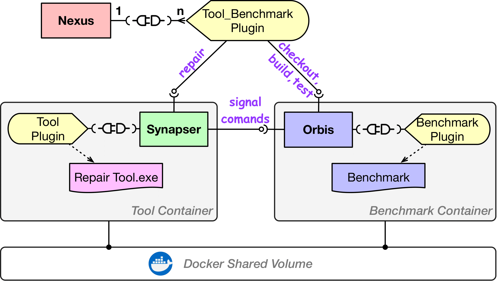

# Maestro Platform
**Maestro** is a platform that provides an accessible means of performing automated repair of software vulnerabilities 
in isolated environments and in an out-of-the-box manner. **Maestro** has a decentralized and microservice-based architecture 
based on Docker containers. 

**Maestro** is composed of an orchestration component, ***Nexus***, and two components ***Orbis*** and 
***Synapser***, that respectively convert tools and benchmarks into microservices. To integrate a tool or benchmark in 
**Maestro**, a developer only needs to develop a plugin for its respective component, ***Synapser*** or ***Orbis***. For ***Nexus***, the 
plugin connects with ***Synapser*** and ***Orbis***, and it is necessary for each tool/benchmark pair.



## Install Nexus
To install Nexus, perform the following steps:

### Download repo
```shell
git clone https://github.com/epicosy/nexus
cd nexus
```
### Install dependencies
```shell
./install_deps.sh
pip3 install -r requirements.txt
```

### Init database
```shell
./init_db.sh 
```
If it fails, use ```sudo -i -u postgres```
### Install package and configs
```
pip3 install . 
mkdir -p ~/.nexus/config/plugins.d
mkdir -p ~/.nexus/plugins/nexus
```

Change the docker volume bind location in the nexus.yml
```
cp config/nexus.yml ~/.nexus/config
cp config/plugins/* ~/.nexus/config/plugins.d
cp nexus/plugins/nexus/* ~/.nexus/plugins/nexus
```

## Setup Benchmark
To add a benchmark to Nexus, a schema file is necessary. 
Also, the benchmark should provide the necessary bindings for Orbis, 
for that please follow [this tutorial](https://github.com/epicosy/orbis/blob/main/TUTORIAL.md).
The file name must have the **name** of the benchmark and should be written in **YAML**. 
For instance, the following [schema file](https://github.com/epicosy/nexus/blob/main/config/plugins/cgc.yml) defines the
CGC benchmark. The file should have the following structures/attributes:
- `name` - name of the benchmark;
  - `type` - benchmark;
  - `image`
    - `tag` - docker image tag;
    - `repo` - GitHub/DockerHub repository (e.g., [CGC](https://github.com/epicosy/cgc));
  - `container`
    - `name` - of the Docker container
    - `api`: 
      - `port` - Orbis API port number

After having the benchmark defined, you should create the benchmark instance by running:
```shell
$ nexus benchmark create -N __name_of_the_benchmark__
```

Then, you should install the Orbis API for the benchmark instance by running:
```shell
$ nexus benchmark setup -N __name_of_the_benchmark__
```

At last, you should serve the Orbis API for the benchmark instance with:
```shell
$ nexus benchmark serve -N __name_of_the_benchmark__
```

After having the server up, you can query the available vulnerabilities in the benchmark with:
```shell
$ nexus -vb cwe list

Id               CWE  CVE    Program      Benchmark
-------------  -----  -----  -----------  -----------
CROMU_00003_1    787         CROMU_00003  cgc
CROMU_00008_1    119         CROMU_00008  cgc
CROMU_00009_1    787         CROMU_00009  cgc
CROMU_00009_2    476         CROMU_00009  cgc
CROMU_00057_1    122         CROMU_00057  cgc
KPRCA_00010_1    122         KPRCA_00010  cgc
KPRCA_00020_1    125         KPRCA_00020  cgc
YAN01_00010_1    824         YAN01_00010  cgc
YAN01_00011_1    125         YAN01_00011  cgc
```


## Setup Tool
Adding a tool to Nexus is similar to adding a benchmark. 
You should also create a schema file that follows the structure and attributes introduced above for the benchmark.
The only different attribute is the `type`, it must be set to **tool**. 
The following [schema file](https://github.com/epicosy/nexus/blob/main/config/plugins/genprog.yml) defines the
[GenProg tool](https://github.com/epicosy/genprog-code).
Providing, setting up, and serving the tool is similar to the steps above:
```shell
$ nexus tool create -N __name_of_the_tool__
$ nexus tool setup -N __name_of_the_tool__
$ nexus tool serve -N __name_of_the_tool__
```

## Setup Nexus plugin

With the tool/benchmark pair defined and instantiated, you should define a plugin file in Python that implements 
the repair workflow. We will use the 
[GenProg/CGC plugin](https://github.com/epicosy/nexus/blob/main/nexus/plugins/nexus/genprog_cgc.py) as example.

The file must include a class that extends the 
[NexusHandler](https://github.com/epicosy/nexus/blob/main/nexus/core/handlers/nexus.py). 

```python
from nexus.core.handlers.nexus import NexusHandler

class GenprogCGCRepairTask(NexusHandler):
```

The class should also define the inner class `Meta` with a unique label that will be used as an identifier for 
the commands:


```python
    class Meta:
        label = 'genprog_cgc'
```

The class should implement the `run` method that defines the repair workflow. This method receives as arguments 
a [program](https://github.com/epicosy/nexus/blob/main/nexus/core/data/store.py#L90), 
a [vulnerability](https://github.com/epicosy/nexus/blob/main/nexus/core/data/store.py#L73), 
and the [context](https://github.com/epicosy/nexus/blob/main/nexus/core/data/context.py) which gives access to the 
tool/benchmark instances. 

```python
    def run(self, program, vulnerability, context):
```

A default workflow should start by checking out the target vulnerability to the working directory. 
That returns a [program instance](https://github.com/epicosy/nexus/blob/main/nexus/core/data/store.py#L124):
```python
        program_instance = self.orbis.checkout(context.benchmark.instance, vuln=vulnerability)
```

Then, a pre-build of the program instance is necessary to obtain the relevant build information (directory, args, etc.).
These are automatically passed to the **program instance**:
```python
        self.orbis.build(context.benchmark.instance, program_instance=program_instance, args={'save_temps': True})
```

For the tool to interact with the benchmark, 
[signals](https://github.com/epicosy/nexus/blob/main/nexus/core/data/store.py#L67) need to be created. These mimic the 
commands the tool needs for running the repair on the target program instance. 
A [command](https://github.com/epicosy/nexus/blob/main/nexus/core/data/store.py#L34) must receive the 
`program instnace id`, `vulnerability id`, and the `endpoint url` that can be obtained by calling the Orbis API
with the respective `action`. Depending on the tool, the commands can vary, the most common are:
- The test command:
```python
        test_command = Command(iid=program_instance.iid, vid=vulnerability.id,
                               url=self.orbis.url(action='test', instance=context.benchmark.instance))
        test_command.add_arg('exit_fail')
        test_command.add_arg('neg_pov')
        test_command.add_arg('replace_neg_fmt', ['n', 'pov_'])
        test_command.add_arg('replace_pos_fmt', ['p', 't'])
        test_command.add_placeholder(name='tests', value='__TEST_NAME__')
        test_signal = Signal(arg='--test-command', command=test_command)
```
- The build command: 
```python
        build_command = Command(iid=program_instance.iid, vid=vulnerability.id,
                                url=self.orbis.url(action='build', instance=context.benchmark.instance))
        build_command.add_arg('cpp_files')
        build_command.add_arg('exit_err')
        build_command.add_arg('save_temps')
        build_command.add_arg('replace_ext', ['.c', '.i'])
        build_command.add_arg(name='inst_files', value=manifest.format(delimiter=' '))
        build_command.add_placeholder(name='fix_files', value='__SOURCE_NAME__')
        compile_signal = Signal(arg='--compiler-command', command=build_command)
```

Arguments can be added to the commands with the `add_arg` method. Notice, these arguments are related to the benchmark 
and can vary. The commands can also receive `placeholders` with the `add_placeholder` method. The placeholders are 
special arguments that receive values inserted by the tool during the repair process. For instance, the GenProg tool 
replaces the `__SOURCE_NAME__` with the patch file generated before calling the `compiler` command
— i.e. the build command.

The tool can also receive arguments, which should be specified in a dictionary, as the following: 

```python
        args = {
            '--pos-tests': len(program.oracle['cases']),
            '--neg-tests': len(vulnerability.oracle['cases'])
        }
```

At the end of the workflow the `repair` should be executed by the tool through the Synapser API.
The `repair` method receives the `signals`, the arguments `args`, the program instance id `iid`, 
the `program instance`, the `manifest`, and the tool instance `instnace`: 

```python
        response = self.synapser.repair(signals=[test_signal, compile_signal], args=args, iid=program_instance.iid,
                                        program_instance=program_instance, manifest=manifest.locs,
                                        instance=context.tool.instance)
```

The `repair request` returns a `response` with the `id` for the `repair instance` created by the Synapser API.
```python
        response_json = response.json()
        self.app.log.info("RID: " + str(response_json['rid']))
```

At last, is **crucial** to register the created plugin through the `load` function:

```python
def load(app):
    app.handler.register(GenprogCGCRepairTask)
```

Having defined the plugin for the workflow between the tool and benchmark, you can now execute a repair on a 
target vulnerability with the `repair` command:

```
usage: nexus repair [-h] [-V VULNS [VULNS ...]] [-t THREADS] [-T TIMEOUT] -N NAME

optional arguments:
  -h, --help            show this help message and exit
  -V VULNS [VULNS ...], --vulns VULNS [VULNS ...]
                        The target vulnerabilities' id
  -t THREADS, --threads THREADS
                        Number of threads for running in parallel multiple tasks.
  -T TIMEOUT, --timeout TIMEOUT
                        Timeout in seconds for each running task.
  -N NAME, --name NAME  The name of the target Nexus
```

The following command runs `GenProg` on the vulnerability with id `YAN01_00010_1` in the `cgc` benchmark.
```shell
$ nexus -vb repair -V YAN01_00010_1 -N genprog_cgc;
```

You should expose the `id` for the `repair instance` in order to follow later the status of the `repair instance`:
```shell
$ nexus tool status --id __repair_instance_id__ --name __name_of_the_tool__ --bench __name_of_the_benchmark__ 
```

To follow in real time the repair execution, use:
```shell
$ nexus -vb tool stream --id __repair_instance_id__ --name __name_of_the_tool__
```

To have access to the patches produced by the tool for a specific `repair instance`, access the `patches` endpoint of 
the tool on the browser:
```
http://172.17.0.3:8080/patches/23
```
Where `172.17.0.3:8080` is the ip with the port number for the Synapser API for the tool instance. `23` is the 
`repair instance id`. You should replace both accordingly.
